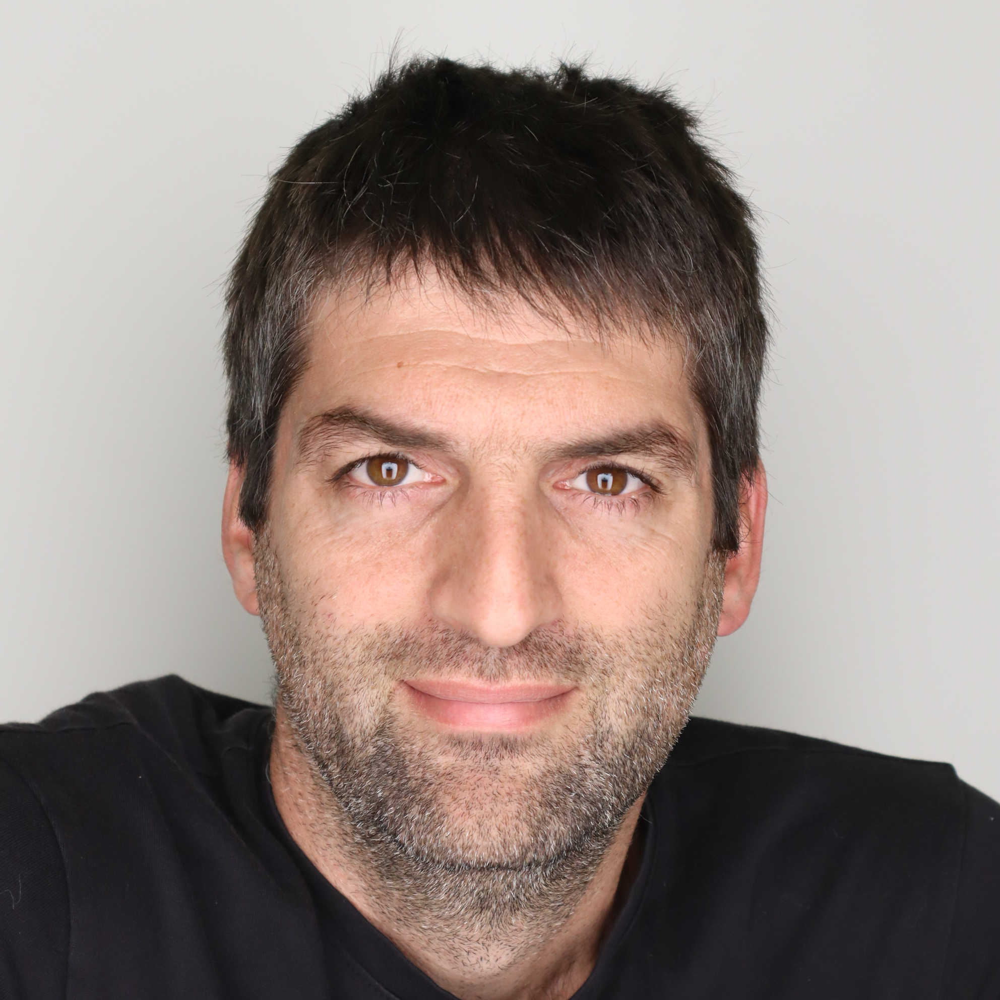

::: {.welcome-headline}
 
Doron Kam's research group
:::

<!-- ::: {.welcome-subheadline} -->
<!-- Light-enabled manufacturing of biological materials -->
<!-- ::: -->

<!-- {fig-alt="Modern materials-science laboratory bench" .hero-image} -->

::: {.home-section-heading}
<!-- Mission -->
:::

We use biological and biocompatible building blocks and advanced fabrication methods to program how materials form, organize, and behave across scales. Rather than treating manufacturing solely as a means to make shapes, we use it to encode function. We create programmable materials for future applications in food, medical, and sustainable technologies.

**We are a new research group at Tel-Hai University, launching in October 2026**

::: {.home-section-heading}
Research directions
:::

:::{#home-research-tiles}
:::

::: {.theme-band-learn-more}
[Learn more → Research](research.qmd)
:::

<!-- ::: {.home-section-heading} -->
<!-- Recent publications -->
<!-- ::: -->

<!-- :::{#recent-pubs} -->
<!-- ::: -->

<!-- [See all publications →](publications/index.qmd) -->

::: {.home-section-heading}
Join us
:::

We are actively recruiting motivated postdocs, Ph.D. students, and M.Sc. students. Read more on the [Open Positions](positions.qmd) page.
